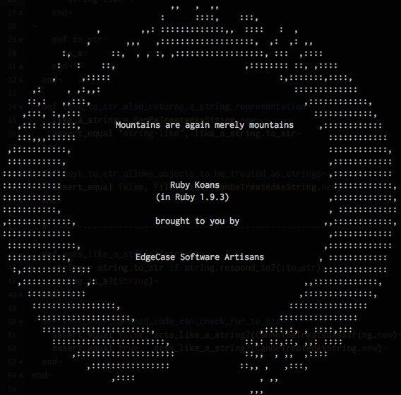

#Ruby Koans

###[Learn Ruby With the Neo Ruby Koans](http://rubykoans.com/)

The Koans walk you along the _path to enlightenment_ in order to learn Ruby. The goal is to learn the Ruby language, syntax, structure, and some common 
functions and libraries. We also teach you culture. Testing is not just something we pay lip service to, but something we live. It is essential in your quest to learn and do great things in the language.

###The Path to Enlightenment

You can run the tests by calling the `path_to_enlightment.rb` file.

In your terminal, while in the `ruby_koans` directory, type:

`[ ruby_koans ] $ ruby path_to_enlightenment.rb`

